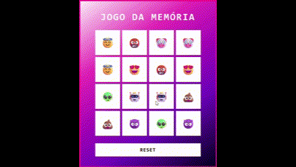

# Criando um Jogo da memória com Emojis Utilizando Javascript

Implementação de um jogo de memória utilizando emojis, onde os jogadores devem encontrar pares correspondentes. O jogo é construído com HTML, CSS e JavaScript.

## Funcionamento ⚙️

O jogo começa exibindo as cartas com os emojis embaralhados. O jogador deve clicar nas cartas para virá-las e revelar o emoji correspondente. Se duas cartas viradas forem iguais, elas permanecem abertas. Se forem diferentes, as cartas são fechadas após um breve atraso.

### Fluxo 🗺️

1. O jogador clica em duas cartas para revelá-las.
2. O código compara os emojis das duas cartas abertas.
3. Se os emojis forem iguais, as cartas permanecem abertas.
4. Se forem diferentes, as cartas são fechadas automaticamente após 500ms.
5. O jogo termina quando todas as cartas são combinadas.

## Tecnologias Utilizadas 💻

- **HTML**: Estrutura da página.
- **CSS**: Estilização das cartas e layout geral do jogo.
- **JavaScript**: Lógica do jogo (embaralhamento, controle de cliques e verificação de correspondências).

## Como Rodar 🕹️

1. Clone ou baixe o repositório.
2. Abra o arquivo `index.html` no navegador para jogar.

## Alterações 🛠️

- [ ] Substituição por grid-layout;
- [ ] Substituição do efeito *flip* (Compatibilidade Firefox/Chrome);
- [ ] Mostrar posições iniciais;
- [ ] Correção ao selecionar o mesmo quadrado;
- [ ] Correção ao selecionar rapidamente muitos quadrados;
